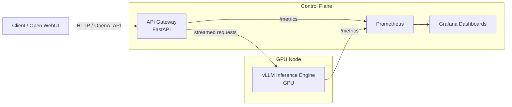

# GPU-Accelerated LLM Inference Service

<p align="center">
  
  
  
  
  
  
  
  
</p>

I built a single-GPU LLM inference service focused on controlled concurrency, bounded queueing, streaming responses, and full observability.

---

## Overview

The service runs vLLM behind a custom FastAPI gateway that enforces concurrency limits, bounded queueing, and request timeouts.

It is structured as a single-node inference stack with a clear separation between:

- Inference engine (vLLM)
- Control layer (gateway)
- Observability stack (Prometheus + Grafana)

Key design constraints:

- Fixed GPU concurrency limit (`MAX_ACTIVE=2`) to prevent VRAM exhaustion.
- Bounded in-memory queue with explicit timeout and size limit.
- Deterministic backpressure (429 / 503) instead of uncontrolled latency growth.
- Real-time metrics for latency (p50/p95), queue depth, RPS, and GPU usage.
- Five focused Grafana dashboards.

Under sustained local load, the system:

- Handles concurrent streaming requests without OOM.
- Keeps queue depth bounded.
- Makes saturation behavior observable.

---

### Engineering Highlight

Stabilized GPU telemetry (DCGM), restored full saturation visibility, and enabled safe `MAX_ACTIVE` tuning under load.  
See [docs/engineering-insights.md](docs/engineering-insights.md) for full details.

---

## Why this project exists

Most LLM examples focus on prompts or UI.  
This project focuses on operating a model as a service.

Serving a large model on a single GPU introduces constraints:

- Memory is fixed.
- Concurrency must be limited.
- Latency degrades under burst traffic.
- Saturation is invisible without instrumentation.

The goal is to make these constraints measurable and controlled.

---

## Architecture (Mermaid)

The system is separated into clear layers:

- **Inference engine (vLLM)** — runs the model and owns the GPU.
- **API gateway (FastAPI)** — enforces concurrency limits, manages queueing, and exposes metrics.
- **Observability stack** — Prometheus and Grafana.
- **Optional UI** — Open WebUI for manual testing.

This separation keeps GPU control logic outside the inference engine and makes saturation and latency observable.



---

### Project structure

```
gpu-llm-inference-service/
├── api/                                 # FastAPI GPU gateway (queueing, metrics, streaming proxy)
├── compose/                             # Docker Compose stack (vLLM, gateway, Prometheus, Grafana, Open WebUI)
├── monitoring/
│   ├── prometheus/                      # Prometheus scrape config
│   └── grafana/
│       ├── dashboards/                  # Grafana dashboards JSON (versioned)
│       └── provisioning/                # Datasource + dashboards provisioning
├── docs/
│   └── screenshots/                     # README screenshots (dashboards, UI, code)
├── .gitignore
├── LICENSE
└── README.md
```

---

## Components

### vLLM (Inference Engine)

- Runs the GPU-backed model server (OpenAI-compatible API).
- Owns the GPU and performs inference.
- Exposes:
  - `GET /health`
  - `GET /v1/models`
  - `POST /v1/chat/completions` (streaming)
  - `GET /metrics` (Prometheus metrics)

### API Gateway (FastAPI)

- Acts as the single public entrypoint.
- Handles GPU protection and request flow control.

Responsibilities:

- Concurrency control (`MAX_ACTIVE`)
- Queueing and backpressure (`QUEUE_MODE`, `QUEUE_MAX`, `QUEUE_TIMEOUT_S`)
- Request timeouts (`REQUEST_TIMEOUT_S`)
- Operational endpoints:
  - `GET /health`
  - `GET /metrics`
  - `GET /v1/models` (proxy)
  - `POST /v1/chat/completions` (proxy + queue + stream)

### Prometheus

- Scrapes metrics from:
  - API Gateway: `http://api:8080/metrics`
  - vLLM: `http://vllm:8000/metrics`
  - (Optional) DCGM Exporter: `http://dcgm-exporter:9400/metrics`
- Collects request, latency, queue, and GPU metrics.

### Grafana

- Uses Prometheus as a datasource.
- Dashboards are stored as JSON in:
  - `monitoring/grafana/provisioning/dashboards/`
- Visualizes latency, saturation, queue depth, and GPU usage.

### Open WebUI (Optional)

- Provides a UI for manual interaction and testing.
- Connects to the same OpenAI-compatible endpoints (vLLM or the API gateway).

---

## Request Lifecycle (High-Level)

1. Client sends `POST /v1/chat/completions` to the API Gateway.
2. Gateway performs health checks and concurrency validation.
3. Request either:
   - Proceeds immediately (free GPU slot), or
   - Enters bounded queue, or
   - Is rejected (429).
4. Streaming response is proxied from vLLM (SSE).
5. Metrics are updated (latency, queue depth, active slots).

Full flow description: see [docs/request-lifecycle.md](docs/request-lifecycle.md).

---

## Observability

The system exposes metrics for all critical control points:

- Request rate and error rate
- Latency percentiles (p50 / p95 / p99)
- Active GPU slots and queue depth
- GPU utilization and memory (DCGM)

Metrics are collected via Prometheus and visualized in Grafana dashboards.

For full metric breakdown and dashboard details, see
[docs/observability.md](docs/observability.md).

---

## Concurrency & Backpressure

See the [backpressure documentation](docs/backpressure.md) for detailed concurrency behavior.

---

## How to run (local GPU)

This project runs on a single GPU machine using Docker and NVIDIA Container Toolkit.

Tested with:
- NVIDIA GPUs (RTX 3090 / 4090 / A-series)
- NVIDIA drivers with CUDA support
- Docker
- nvidia-container-toolkit

### Prerequisites

- Docker Engine
- Docker Compose v2
- NVIDIA driver installed on the host
- NVIDIA Container Toolkit

Verify GPU access from Docker:

docker run --rm --gpus all nvidia/cuda:12.4.1-base-ubuntu22.04 nvidia-smi

If the GPU is visible, you are ready to proceed.


### Start the stack

From the repository root:

cd compose
docker compose up -d

This will start:
- vllm — GPU-backed LLM inference server
- api — API gateway with queueing & metrics
- open-webui — Web UI (optional)
- prometheus — metrics collection
- grafana — dashboards

### Verify services

API Gateway health:
curl http://localhost:8080/health

vLLM model availability:
curl http://localhost:8000/v1/models

Prometheus:
http://localhost:9090

Grafana:
http://localhost:9091

Default credentials:
user: admin
password: admin

### Send a test request

Example chat request via API Gateway:

curl -X POST http://localhost:8080/v1/chat/completions \
  -H "Content-Type: application/json" \
  -d '{
    "model": "qwen25-14b",
    "messages": [
      { "role": "user", "content": "Hello!" }
    ]
  }'

Responses are streamed using Server-Sent Events (SSE).

### Stopping the stack

docker compose down

---

## Limitations

This project intentionally focuses on a single-node, infrastructure-first design.

See the [limitations documentation](docs/limitations.md) for full details.

---

## What this project demonstrates

- GPU-aware service design  
- Explicit concurrency control and bounded queueing  
- Deterministic backpressure under load  
- Observable latency and saturation behavior  
- Clean separation between inference, control layer, and monitoring  

The focus is on infrastructure behavior under load, not model benchmarking or prompt quality.

---

## Roadmap

See the [roadmap](docs/roadmap.md) for planned improvements and future direction.

---

## Screenshots

### API Overview — Idle


System in steady state.  
No active requests, no queue, zero error rate.

---

### API Overview — Under Load


Active traffic hitting the gateway.  
RPS increases, latency changes, slots become saturated.

---

### API Gateway — Under Load


Gateway-level view showing concurrency limit, queue wait time, latency percentiles, and error rate.

---

### Capacity & Saturation — Under Load


GPU slot utilization and queue pressure.  
Demonstrates saturation behavior and latency growth.

---

### LLM Performance — Under Load


Model-level metrics including latency percentiles, tokens per second, and request rate under stress.

---

### Infrastructure Health — GPU Metrics


Hardware-level metrics: GPU utilization, memory usage, temperature, power draw, and API CPU usage.

---

### Web Interface


A compact, single-file `main.py` implementation demonstrating:

---

## License

This project is released under the MIT License.

See the `LICENSE` file for details.