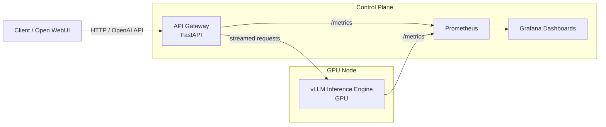
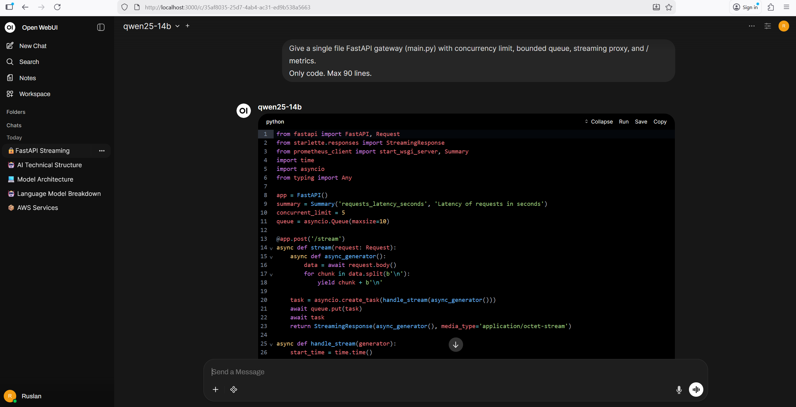

# GPU-Accelerated LLM Inference Service

<p align="center">
  
  
  
  
  
  
  
  
</p>

I built a single-GPU LLM inference service focused on controlled concurrency, bounded queueing, streaming responses, and full observability.

---

## Overview

The service runs vLLM behind a custom FastAPI gateway that enforces concurrency limits, bounded queueing, and request timeouts.

It is structured as a single-node inference stack with a clear separation between:

- Inference engine (vLLM)
- Control layer (gateway)
- Observability stack (Prometheus + Grafana)

Key design constraints:

- Fixed GPU concurrency limit (`MAX_ACTIVE=2`) to prevent VRAM exhaustion.
- Bounded in-memory queue with explicit timeout and size limit.
- Deterministic backpressure (429 / 503) instead of uncontrolled latency growth.
- Real-time metrics for latency (p50/p95), queue depth, RPS, and GPU usage.
- Five focused Grafana dashboards.

Under sustained local load, the system:

- Handles concurrent streaming requests without OOM.
- Keeps queue depth bounded.
- Makes saturation behavior observable.

---

## Why this project exists

Most LLM examples focus on prompts or UI.  
This project focuses on operating a model as a service.

Serving a large model on a single GPU introduces constraints:

- Memory is fixed.
- Concurrency must be limited.
- Latency degrades under burst traffic.
- Saturation is invisible without instrumentation.

The goal is to make these constraints measurable and controlled.

---

## Architecture (Mermaid)

The system is separated into clear layers:

- **Inference engine (vLLM)** — runs the model and owns the GPU.
- **API gateway (FastAPI)** — enforces concurrency limits, manages queueing, and exposes metrics.
- **Observability stack** — Prometheus and Grafana.
- **Optional UI** — Open WebUI for manual testing.

This separation keeps GPU control logic outside the inference engine and makes saturation and latency observable.



---

## Components

### vLLM (Inference Engine)

- Runs the GPU-backed model server (OpenAI-compatible API).
- Owns the GPU and performs inference.
- Exposes:
  - `GET /health`
  - `GET /v1/models`
  - `POST /v1/chat/completions` (streaming)
  - `GET /metrics` (Prometheus metrics)

### API Gateway (FastAPI)

- Acts as the single public entrypoint.
- Handles GPU protection and request flow control.

Responsibilities:

- Concurrency control (`MAX_ACTIVE`)
- Queueing and backpressure (`QUEUE_MODE`, `QUEUE_MAX`, `QUEUE_TIMEOUT_S`)
- Request timeouts (`REQUEST_TIMEOUT_S`)
- Operational endpoints:
  - `GET /health`
  - `GET /metrics`
  - `GET /v1/models` (proxy)
  - `POST /v1/chat/completions` (proxy + queue + stream)

### Prometheus

- Scrapes metrics from:
  - API Gateway: `http://api:8080/metrics`
  - vLLM: `http://vllm:8000/metrics`
  - (Optional) DCGM Exporter: `http://dcgm-exporter:9400/metrics`
- Collects request, latency, queue, and GPU metrics.

### Grafana

- Uses Prometheus as a datasource.
- Dashboards are stored as JSON in:
  - `monitoring/grafana/provisioning/dashboards/`
- Visualizes latency, saturation, queue depth, and GPU usage.

### Open WebUI (Optional)

- Provides a UI for manual interaction and testing.
- Connects to the same OpenAI-compatible endpoints (vLLM or the API gateway).

---

## Request lifecycle

1. **Client request**
   - A client (Open WebUI, curl, or any OpenAI-compatible SDK) sends:
     ```
     POST /v1/chat/completions
     ```
   - Request is sent to the **API Gateway**, not directly to vLLM.

2. **Health & readiness check**
   - API Gateway verifies that vLLM is reachable and has at least one loaded model.
   - If vLLM is unavailable:
     - Request is rejected with `503 Service Unavailable`.

3. **Concurrency gate (GPU protection)**
   - The gateway enforces `MAX_ACTIVE`:
     - This represents the **maximum number of concurrent GPU inference streams**.
   - If a slot is free → request proceeds immediately.
   - If no slot is free:
     - `QUEUE_MODE=queue` → request enters a bounded queue.
     - `QUEUE_MODE=reject` → request fails fast with `429`.

4. **Queueing & backpressure**
   - Queue is bounded (`QUEUE_MAX`).
   - Each queued request:
     - Waits up to `QUEUE_TIMEOUT_S`.
     - If timeout is exceeded → `503 Queue timeout`.
   - Queue depth is tracked as a Prometheus gauge.

5. **Streaming inference**
   - Once a GPU slot is acquired:
     - Request is forwarded to:
       ```
       vLLM /v1/chat/completions (stream=true)
       ```
   - Tokens are streamed back to the client as **Server-Sent Events (SSE)**.
   - Gateway does **not buffer** full responses.

6. **Metrics & accounting**
   - During streaming:
     - Active requests gauge is incremented.
     - Tokens are counted approximately.
     - Time to first token and throughput are estimated.
   - On completion:
     - Latency histogram is observed.
     - GPU slot is released.
     - Queue depth is updated.

7. **Client receives final event**
   - Final SSE frame contains:
     - Approximate token count
     - Total latency
     - Tokens-per-second estimate

---

## Observability & Metrics

The system exposes metrics for all critical control points: concurrency, queueing, latency, errors, and GPU state.

### Metrics sources

- **API Gateway**
  - `http://api:8080/metrics`
  - Request rate, error rate, latency, active requests, queue depth, approximate tokens/sec

- **vLLM**
  - `http://vllm:8000/metrics`
  - Internal inference metrics (model-dependent)

- **DCGM Exporter (NVIDIA)**
  - `http://dcgm-exporter:9400/metrics`
  - GPU utilization, memory usage, temperature, power draw

### Core operational signals

**Traffic and errors**
- `api_requests_total` (rate)
- Error rate excluding `/metrics` and `/health`

**Latency**
- `api_request_latency_seconds_bucket`
  - p50 / p95 / p99 via `histogram_quantile()`

**Backpressure**
- `api_active_requests`
- `api_queue_depth`
- Saturation proxy: `api_active_requests / MAX_ACTIVE`

**GPU state**
- Utilization (%)
- Memory used / free (MiB)
- Temperature (°C)
- Power draw (W)

### Grafana dashboards

Dashboards are organized to show:

- Current system state
- Latency trends
- Queue and saturation behavior
- GPU limits and utilization

### Prometheus scrape targets

By default, Prometheus scrapes:

- `api:8080`
- `vllm:8000`
- `dcgm-exporter:9400`

If a target reports `up=0`, related panels will show no data.

---

## Queueing & Backpressure

A GPU is a shared and limited resource.  
To keep behavior predictable, the gateway enforces explicit concurrency limits and backpressure at the API layer.

The goal is to keep latency bounded and system behavior measurable under load.

### Concurrency limit (GPU slots)

The API Gateway enforces a fixed upper bound on concurrent GPU-backed requests.

- `MAX_ACTIVE` — maximum number of simultaneous inference streams
- Metrics:
  - `api_active_requests` — current number of active requests
  - Saturation proxy:
    - `api_active_requests / MAX_ACTIVE`

This prevents VRAM exhaustion and uncontrolled latency growth.

### Queue mode vs Reject mode

Two backpressure strategies are supported.

#### Queue mode (`QUEUE_MODE=queue`)

- Requests exceeding `MAX_ACTIVE` enter a bounded in-memory queue
- Limits:
  - `QUEUE_MAX` — maximum queue length
  - `QUEUE_TIMEOUT_S` — maximum wait time before returning 503

This increases throughput at the cost of higher tail latency.

#### Reject mode (`QUEUE_MODE=reject`)

- Requests are immediately rejected with HTTP 429 when no GPU slot is available
- Intended for clients that implement retries with backoff

This keeps latency predictable and avoids queue buildup.

### Operational impact

Without explicit backpressure:

- Latency increases under burst traffic
- Queue growth is not visible
- GPU memory pressure can escalate

With explicit limits:

- Latency remains bounded
- Rejections are intentional (429 / 503)
- Saturation is visible via metrics and dashboards

### Tuning considerations

- To increase throughput:
  - Raise `MAX_ACTIVE` cautiously, within GPU memory limits
  - Use queue mode with a bounded timeout

- To prioritize latency:
  - Use reject mode
  - Handle retries client-side

- Continuous growth in `api_queue_depth` usually indicates:
  - Incoming traffic exceeds GPU capacity
  - `MAX_ACTIVE` is too low
  - Context size or model size is too heavy

---

## How to run (local GPU)

This project runs on a single GPU machine using Docker and NVIDIA Container Toolkit.

Tested with:
- NVIDIA GPUs (RTX 3090 / 4090 / A-series)
- NVIDIA drivers with CUDA support
- Docker
- nvidia-container-toolkit

### Prerequisites

- Docker Engine
- Docker Compose v2
- NVIDIA driver installed on the host
- NVIDIA Container Toolkit

Verify GPU access from Docker:

docker run --rm --gpus all nvidia/cuda:12.4.1-base-ubuntu22.04 nvidia-smi

If the GPU is visible, you are ready to proceed.

### Project structure

```
gpu-llm-inference-service/
├── api/                                 # FastAPI GPU gateway (queueing, metrics, streaming proxy)
├── compose/                             # Docker Compose stack (vLLM, gateway, Prometheus, Grafana, Open WebUI)
├── monitoring/
│   ├── prometheus/                      # Prometheus scrape config
│   └── grafana/
│       ├── dashboards/                  # Grafana dashboards JSON (versioned)
│       └── provisioning/                # Datasource + dashboards provisioning
├── docs/
│   └── screenshots/                     # README screenshots (dashboards, UI, code)
├── .gitignore
├── LICENSE
└── README.md
```


### Start the stack

From the repository root:

cd compose
docker compose up -d

This will start:
- vllm — GPU-backed LLM inference server
- api — API gateway with queueing & metrics
- open-webui — Web UI (optional)
- prometheus — metrics collection
- grafana — dashboards

### Verify services

API Gateway health:
curl http://localhost:8080/health

vLLM model availability:
curl http://localhost:8000/v1/models

Prometheus:
http://localhost:9090

Grafana:
http://localhost:9091

Default credentials:
user: admin
password: admin

### Send a test request

Example chat request via API Gateway:

curl -X POST http://localhost:8080/v1/chat/completions \
  -H "Content-Type: application/json" \
  -d '{
    "model": "qwen25-14b",
    "messages": [
      { "role": "user", "content": "Hello!" }
    ]
  }'

Responses are streamed using Server-Sent Events (SSE).

### Stopping the stack

docker compose down

---

## Limitations

- Single-node design  
  - Runs on one GPU host (no multi-node scheduling or sharding).

- No autoscaling  
  - GPU capacity is fixed; excess load is handled via queueing or rejection.

- Approximate token accounting  
  - Tokens-per-second and token counts are estimated from streaming deltas.

- No authentication or multi-tenant isolation  
  - The API is intentionally open to keep focus on infrastructure behavior.

- Local-first focus  
  - Not optimized for managed cloud GPU platforms out of the box.

These constraints are deliberate to keep the system simple, transparent, and easy to reason about end-to-end.

---

## What this project demonstrates

- GPU-aware service design  
- Explicit concurrency control and bounded queueing  
- Deterministic backpressure under load  
- Observable latency and saturation behavior  
- Clean separation between inference, control layer, and monitoring  

The focus is on infrastructure behavior under load, not model benchmarking or prompt quality.

---

## Future Improvements

The current version is focused on a single GPU host. Next steps that would make it closer to a production setup:

- Semantic caching (Redis)
  - Cache repeated requests to reduce redundant GPU work.
  - Cache key should include model, prompt, and decoding params.

- Request prioritization
  - Priority classes for latency critical traffic.
  - Avoid starvation with basic fairness rules.

- Multiple vLLM backends
  - Support routing across multiple GPU backends (local or multi node).

- Precise token tracking
  - Use the model tokenizer in the gateway for exact token counts and usage metrics.

- Kubernetes deployment (optional)
  - Run the stack on Kubernetes and scale control plane services.
  - Use custom metrics like queue depth and saturation as signals.

---

## Screenshots

### API Overview — Idle


System in steady state.  
No active requests, no queue, zero error rate.

---

### API Overview — Under Load


Active traffic hitting the gateway.  
RPS increases, latency changes, slots become saturated.

---

### API Gateway — Under Load


Gateway-level view showing concurrency limit, queue wait time, latency percentiles, and error rate.

---

### Capacity & Saturation — Under Load


GPU slot utilization and queue pressure.  
Demonstrates saturation behavior and latency growth.

---

### LLM Performance — Under Load


Model-level metrics including latency percentiles, tokens per second, and request rate under stress.

---

### Infrastructure Health — GPU Metrics


Hardware-level metrics: GPU utilization, memory usage, temperature, power draw, and API CPU usage.

---

### Web Interface



A compact, single-file `main.py` implementation demonstrating:

---

## License

This project is released under the MIT License.

You are free to use, modify, distribute, and build upon the code, subject to the terms of the MIT License.

See the `LICENSE` file for full details.

The name "🚀 Ruslan AWS" and associated branding elements are not covered by the open-source license and may not be used to imply endorsement without permission.