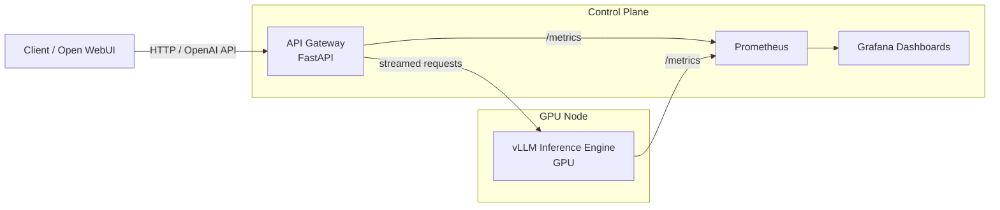
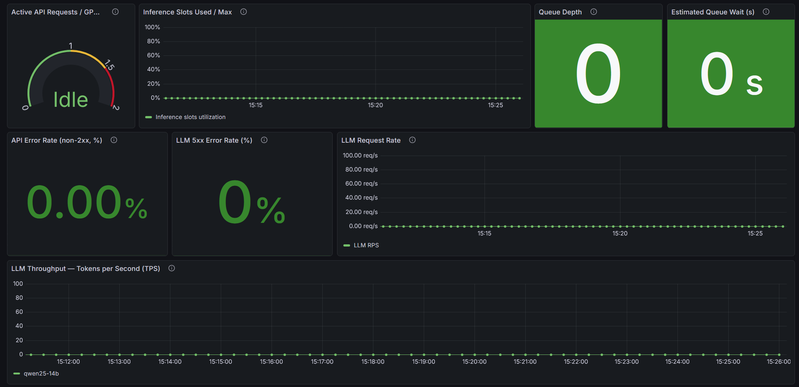
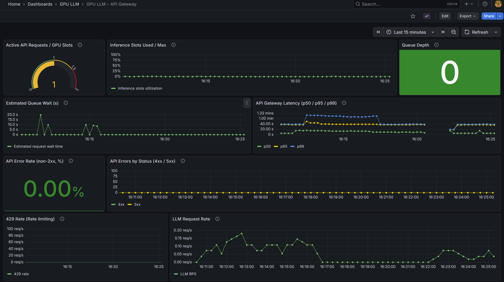
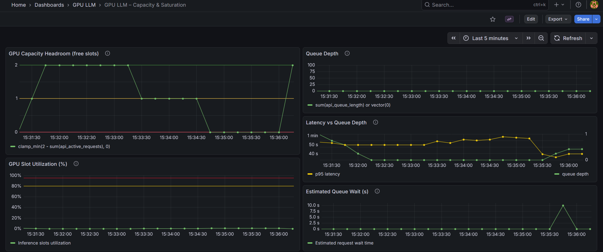
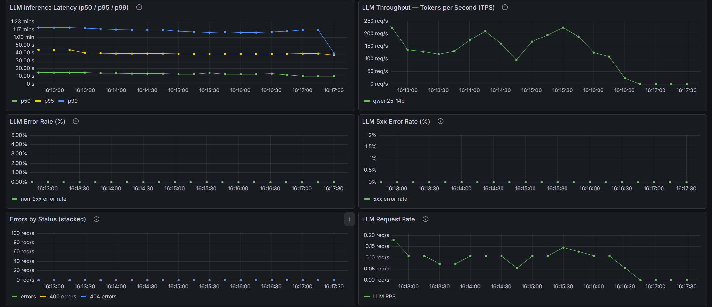
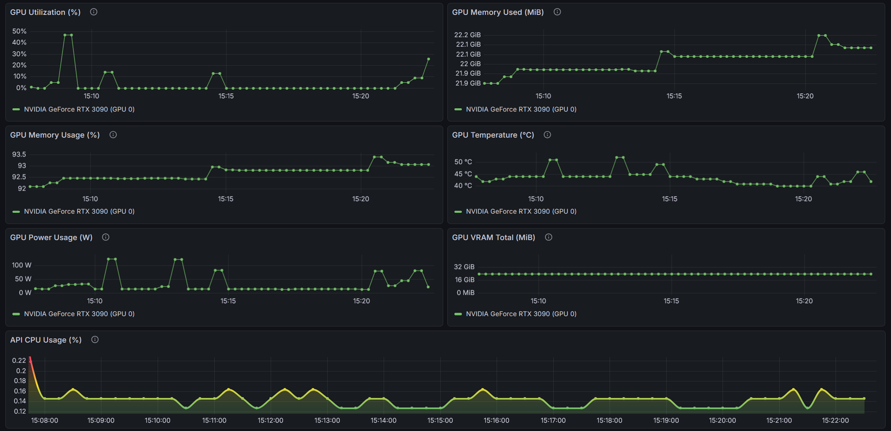
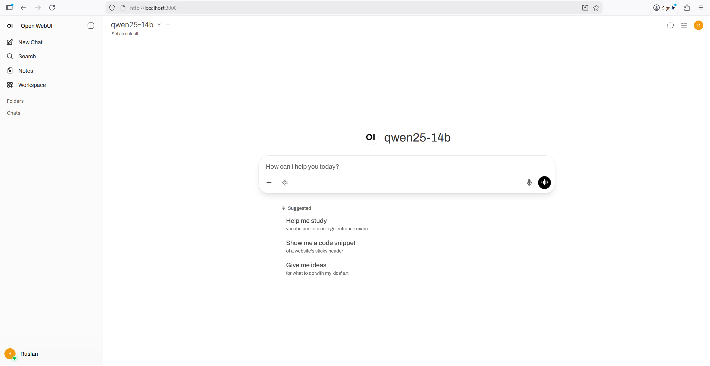

# GPU-Accelerated LLM Inference Service

Production-oriented, GPU-backed LLM inference with explicit concurrency limits, queueing, streaming responses, and Prometheus/Grafana observability.

---

## Overview

This project is a GPU-accelerated LLM inference service built around **vLLM**, with a custom **API gateway**, **request queueing**, and **production-grade observability**.

The system is designed to:
- serve large language models efficiently on a single GPU,
- control GPU saturation via concurrency limits and queueing,
- expose OpenAI-compatible APIs,
- provide clear operational visibility (latency, queue depth, errors, GPU usage).

The focus is not on fine-tuning or model training, but on **reliable, observable inference under load**.

---

## Why this project exists

Most LLM demos focus on model quality or UI, but avoid the hardest part of real-world inference:
**operating a GPU-backed service under load**.

In practice, GPU inference introduces problems that do not exist in typical CPU services:
- GPU memory is a hard limit — requests cannot be scaled horizontally inside one card.
- Uncontrolled concurrency leads to OOM errors or extreme latency spikes.
- Traditional autoscaling does not apply to a single-GPU node.
- Without proper metrics, GPU saturation and queue buildup are invisible.

This project was built to address those gaps.

It demonstrates how to:
- protect a GPU using concurrency limits and explicit queueing,
- apply backpressure instead of crashing or timing out silently,
- expose meaningful operational metrics (latency, queue depth, error rate),
- treat LLM inference as an **infrastructure problem**, not just a model problem.

The goal is not to compete with hosted LLM platforms, but to show **how such systems are actually built and operated**.

---

## Architecture (Mermaid)

The system is intentionally split into clear operational layers:
- **Inference engine** (vLLM) — owns the GPU and executes model inference.
- **API gateway** — enforces concurrency limits, queueing, and exposes metrics.
- **Observability stack** — Prometheus + Grafana for real-time visibility.
- **Optional UI** — Open WebUI for manual interaction.

This separation allows GPU protection, predictable latency, and production-style monitoring.



---

## Components

### vLLM (Inference Engine)
- Runs the **GPU-backed** model server (OpenAI-compatible API).
- Exposes:
  - `GET /health`
  - `GET /v1/models`
  - `POST /v1/chat/completions` (streaming)
  - `GET /metrics` (Prometheus metrics from vLLM)

### API Gateway (FastAPI)
- Single entrypoint you treat as “production API”.
- Responsibilities:
  - **Concurrency control** (`MAX_ACTIVE`) to protect GPU
  - **Queueing / backpressure** (`QUEUE_MODE=queue|reject`, `QUEUE_MAX`, `QUEUE_TIMEOUT_S`)
  - **Request timeouts** (`REQUEST_TIMEOUT_S`)
  - Operational endpoints:
    - `GET /health` (checks vLLM readiness)
    - `GET /metrics` (gateway Prometheus metrics)
    - `GET /v1/models` (proxy)
    - `POST /v1/chat/completions` (proxy + queue + stream)

### Prometheus
- Scrapes metrics from:
  - API Gateway: `http://api:8080/metrics`
  - vLLM: `http://vllm:8000/metrics`
  - (Optional) DCGM Exporter: `http://dcgm-exporter:9400/metrics`

### Grafana
- Pre-provisioned Prometheus datasource.
- Dashboards stored as JSON in:
  - `monitoring/grafana/provisioning/dashboards/`

### Open WebUI (Optional)
- Human-friendly UI to interact with the model.
- Points to the same OpenAI-compatible endpoints (either vLLM directly or the API gateway, depending on configuration).

---

## Request lifecycle

1. **Client request**
   - A client (Open WebUI, curl, or any OpenAI-compatible SDK) sends:
     ```
     POST /v1/chat/completions
     ```
   - Request is sent to the **API Gateway**, not directly to vLLM.

2. **Health & readiness check**
   - API Gateway verifies that vLLM is reachable and has at least one loaded model.
   - If vLLM is unavailable:
     - Request is rejected with `503 Service Unavailable`.

3. **Concurrency gate (GPU protection)**
   - The gateway enforces `MAX_ACTIVE`:
     - This represents the **maximum number of concurrent GPU inference streams**.
   - If a slot is free → request proceeds immediately.
   - If no slot is free:
     - `QUEUE_MODE=queue` → request enters a bounded queue.
     - `QUEUE_MODE=reject` → request fails fast with `429`.

4. **Queueing & backpressure**
   - Queue is bounded (`QUEUE_MAX`).
   - Each queued request:
     - Waits up to `QUEUE_TIMEOUT_S`.
     - If timeout is exceeded → `503 Queue timeout`.
   - Queue depth is tracked as a Prometheus gauge.

5. **Streaming inference**
   - Once a GPU slot is acquired:
     - Request is forwarded to:
       ```
       vLLM /v1/chat/completions (stream=true)
       ```
   - Tokens are streamed back to the client as **Server-Sent Events (SSE)**.
   - Gateway does **not buffer** full responses.

6. **Metrics & accounting**
   - During streaming:
     - Active requests gauge is incremented.
     - Tokens are counted approximately.
     - Time to first token and throughput are estimated.
   - On completion:
     - Latency histogram is observed.
     - GPU slot is released.
     - Queue depth is updated.

7. **Client receives final event**
   - Final SSE frame contains:
     - Approximate token count
     - Total latency
     - Tokens-per-second estimate

---

## Observability & Metrics

This project is built to be observable from day one: every critical bottleneck (GPU concurrency, queueing, latency, errors, GPU health) is measurable and dashboardable.

### Metrics sources

- **API Gateway** exposes Prometheus metrics:
  - `http://api:8080/metrics`
  - Focus: request rate, error rate, latency, active requests, queue depth, tokens/sec (approx)

- **vLLM** exposes Prometheus metrics:
  - `http://vllm:8000/metrics`
  - Focus: vLLM internal performance counters (varies by version/model)

- **DCGM Exporter (NVIDIA)** exposes GPU metrics:
  - `http://dcgm-exporter:9400/metrics`
  - Focus: GPU utilization, memory used/free, temperature, power, etc.

### Key operational signals (what you should watch)

**Traffic & errors**
- `api_requests_total` (rate)
- error rate excluding noise endpoints (`/metrics`, `/health`)

**Latency**
- `api_request_latency_seconds_bucket` (p50/p95/p99 via `histogram_quantile()`)

**Backpressure**
- `api_active_requests`
- `api_queue_depth`
- saturation proxy: `api_active_requests / MAX_ACTIVE`

**GPU health (DCGM)**
- GPU utilization (%)
- framebuffer memory used/free (MiB)
- temperature (°C)
- power draw (W)

### Grafana dashboards

The included dashboard is designed for “operator view”:
- current health at a glance (stat panels)
- performance trends (time series)
- bottlenecks (queue vs saturation vs latency)
- GPU constraints (util/mem/temp)

### Prometheus scrape targets

By default, Prometheus scrapes:
- `api:8080`
- `vllm:8000`
- `dcgm-exporter:9400`

If a target shows `up=0`, the dashboards will display `No data`.

---

## Queueing & Backpressure

GPU is a shared and limited resource.  
This project explicitly addresses this by enforcing **controlled concurrency** and **backpressure** at the API layer.

The goal is not just to “make requests work”, but to ensure **predictable latency, stability, and observability under load**.

### Concurrency limit (GPU slots)

The API Gateway enforces a fixed upper bound on how many requests may actively use the GPU at the same time.

- `MAX_ACTIVE` — maximum number of concurrent GPU-backed requests
- Metrics:
  - `api_active_requests` — current number of active GPU requests
  - GPU saturation (proxy):
    - `api_active_requests / MAX_ACTIVE`

This prevents VRAM exhaustion and latency collapse.

### Queue mode vs Reject mode

Two backpressure strategies are supported:

#### Queue mode (`QUEUE_MODE=queue`)
- Requests exceeding `MAX_ACTIVE` are placed into an in-memory queue
- Limits:
  - `QUEUE_MAX` — maximum queue length
  - `QUEUE_TIMEOUT_S` — maximum wait time before failing with 503

This mode maximizes throughput at the cost of higher tail latency.

#### Reject mode (`QUEUE_MODE=reject`)
- Requests are immediately rejected with HTTP 429 when GPU is busy
- Suitable when clients support retries with exponential backoff

This mode prioritizes latency predictability and fast failure.

### Why this matters in production

Without backpressure:
- Latency grows unbounded
- Queues build up invisibly
- The system fails catastrophically under load

With explicit backpressure:
- Latency remains bounded
- Failures are intentional and observable (429 / 503)
- Bottlenecks are immediately visible in Grafana (queue depth, saturation)

### Tuning guidelines

- For **maximum throughput**:
  - Increase `MAX_ACTIVE` cautiously (bounded by GPU memory)
  - Enable queueing with a reasonable timeout

- For **strict latency SLOs**:
  - Use `QUEUE_MODE=reject`
  - Handle retries on the client side

- If `api_queue_depth` grows continuously:
  - Traffic exceeds GPU capacity, or
  - `MAX_ACTIVE` is too low, or
  - The model / context size is too heavy

---

## How to run (local GPU)

This project is designed to run on a **single GPU machine** using Docker and NVIDIA Container Toolkit.

It has been tested with:
- NVIDIA GPUs (e.g. RTX 3090 / 4090 / A-series)
- NVIDIA drivers with CUDA support
- Docker + nvidia-container-toolkit

### Prerequisites

- Docker Engine
- Docker Compose v2
- NVIDIA driver installed on the host
- NVIDIA Container Toolkit (nvidia-ctk)

Verify GPU access from Docker:

docker run --rm --gpus all nvidia/cuda:12.4.1-base-ubuntu22.04 nvidia-smi

If the GPU is visible, you are ready to proceed.

### Project structure

gpu-llm-inference-service/
├── api/                    # FastAPI GPU gateway (queueing, metrics)
├── compose/                # docker-compose.yaml
├── monitoring/
│   ├── prometheus/         # Prometheus config
│   └── grafana/            # Grafana provisioning & dashboards
└── README.md

### Start the stack

From the repository root:

cd compose
docker compose up -d

This will start:
- vllm — GPU-backed LLM inference server
- api — API gateway with queueing & metrics
- open-webui — Web UI (optional)
- prometheus — metrics collection
- grafana — dashboards

### Verify services

API Gateway health:
curl http://localhost:8080/health

vLLM model availability:
curl http://localhost:8000/v1/models

Prometheus:
http://localhost:9090

Grafana:
http://localhost:9091

Default credentials:
user: admin
password: admin

### Send a test request

Example chat request via API Gateway:

curl -X POST http://localhost:8080/v1/chat/completions \
  -H "Content-Type: application/json" \
  -d '{
    "model": "qwen25-14b",
    "messages": [
      { "role": "user", "content": "Hello!" }
    ]
  }'

Responses are streamed using Server-Sent Events (SSE).

### Stopping the stack

docker compose down

---

## Limitations

- **Single-node design**
  - The project intentionally targets one GPU host (no multi-node scheduling, no sharding).
- **No autoscaling**
  - GPU capacity is fixed; excess load is handled via queueing or rejection.
- **Approximate token accounting**
  - Tokens-per-second and token counts are estimated from streaming deltas, not exact tokenizer output.
- **No authentication / multi-tenant isolation**
  - API is open by design to keep focus on infrastructure and operations.
- **Local-first focus**
  - Not optimized for cloud cost efficiency or managed GPU services out of the box.

These constraints are deliberate to keep the system understandable and auditable end-to-end.

---

## What this project demonstrates

- **GPU-aware system design**
  - Treating GPU as a scarce, shared resource rather than an infinite backend.
- **Production-style LLM serving**
  - vLLM inference with an explicit API gateway instead of direct client access.
- **Backpressure and queueing mechanics**
  - Protecting GPU workloads under bursty or sustained load.
- **Operational observability**
  - Metrics that matter: latency, queue depth, active requests, throughput.
- **Clean separation of concerns**
  - Inference engine, API control plane, and observability stack are isolated.
- **Portfolio-level engineering**
  - A realistic system that mirrors how internal LLM services are built, not demo apps.

This is the kind of project that signals **systems thinking**, not just model usage.

---

## Screenshots

### API Overview — Idle



System in steady state.  
No active requests, no queue, zero error rate.

---

### API Overview — Under Load


Active traffic hitting the gateway.  
RPS increases, latency changes, slots become saturated.

---

### API Gateway — Under Load



Gateway-level view showing concurrency limit, queue wait time, latency percentiles, and error rate.

---

### Capacity & Saturation — Under Load



GPU slot utilization and queue pressure.  
Demonstrates saturation behavior and latency growth.

---

### LLM Performance — Under Load



Model-level metrics including latency percentiles, tokens per second, and request rate under stress.

---

### Infrastructure Health — GPU Metrics



Hardware-level metrics: GPU utilization, memory usage, temperature, power draw, and API CPU usage.

---

### Web Interface



Open WebUI connected to the local API gateway and GPU-backed model.

---

#  License

- Released under the **MIT License** — free to use, modify, and learn from.  
- © **Ruslan Dashkin (“� Ruslan AWS”)**.  
- The branding “� Ruslan AWS” and related visuals are protected against commercial reuse.